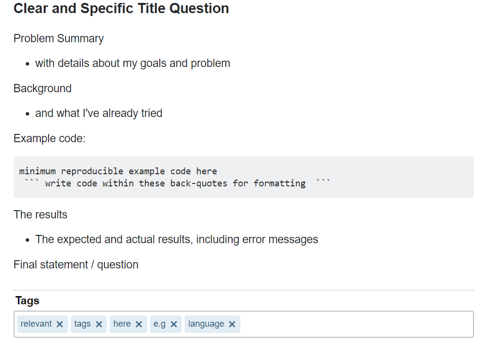
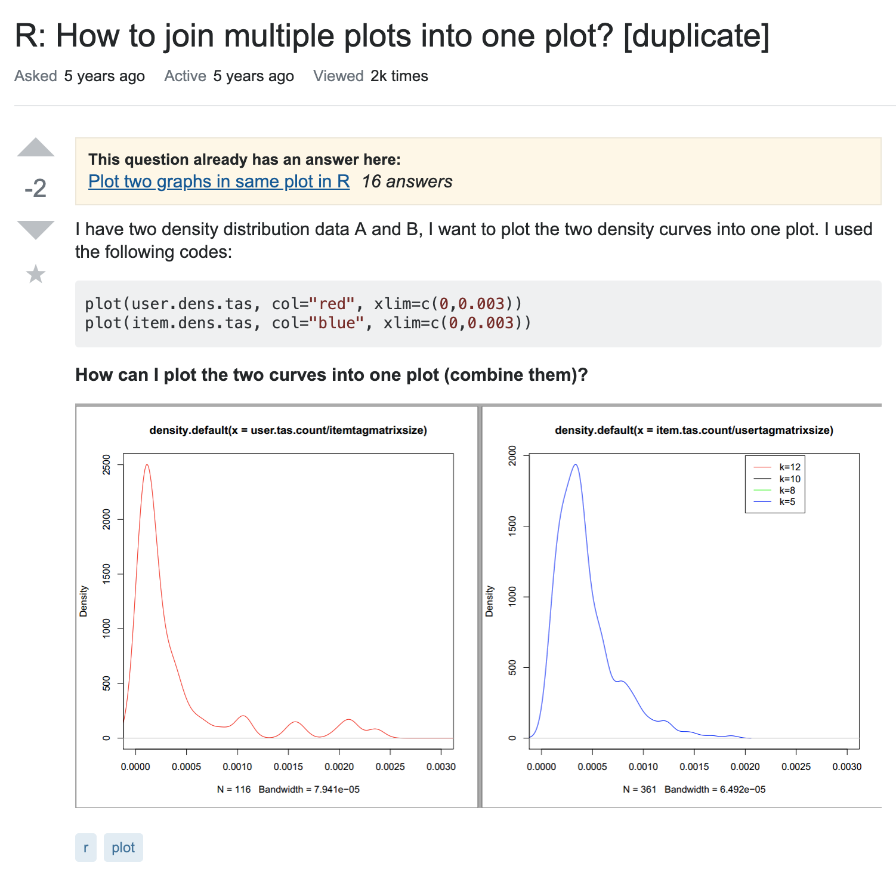
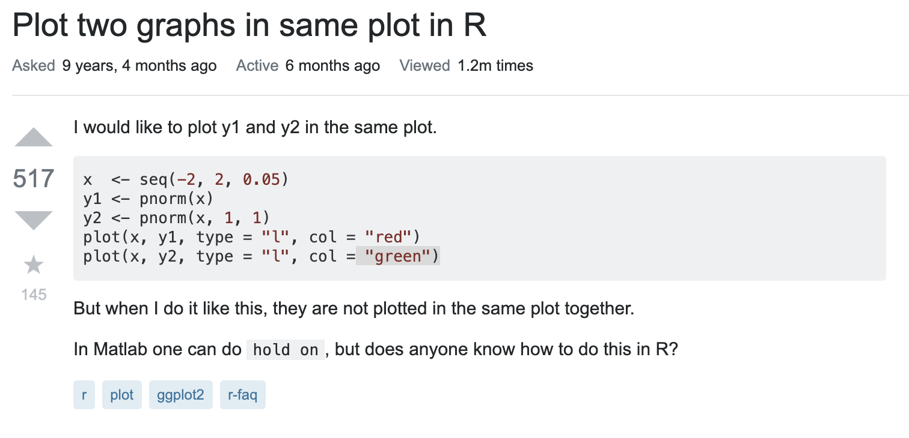
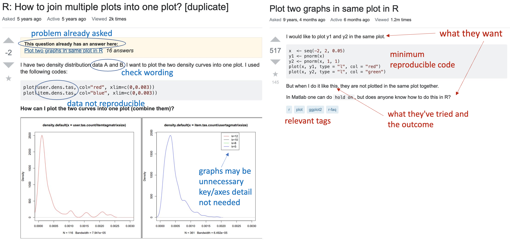
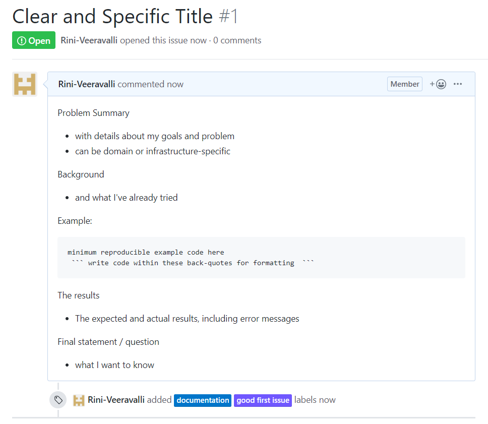

```{r setup, include=FALSE}
options(htmltools.dir.version = FALSE)
```

```{r xaringan-themer, include = FALSE}
library(xaringanthemer)
mono_accent(
  base_color = "#01223F",
  header_font_google = google_font("Montserrat"),
  text_font_google   = google_font("Lato", "400", "400i"),
  code_font_google   = google_font("Droid Mono"),
  text_font_size = "24px",
  header_font_weight = "bolder",
  code_font_size = "0.5em"
)

extra_css <- list(
  ".shadow" = list("text-shadow" = "0 0 10px #000"),
  ".blue2" = list(color = "#36BDF2"),
  ".blue3" = list(color = "#00F2F5"),
  ".gray" = list(color = "lightgray"),
  ".red"   = list(color = "firebrick", opaciy = "1"),
  ".blue" = list(color = "steelblue", opaciy = "1"),
  ".orange" = list(color = "orange", opaciy = "1"),
  ".green" = list(color = "seagreen", opacity = "1"),
  ".violet" = list(color = "darkorchid", opaciy = "1"),
  ".large" = list("font-size" = "120%"),
  ".big" = list("font-size" = "400%"),
  ".small" = list("font-size" = "75%"),
  ".translucent" = list("opacity" = "0.4"),
  ".full-width" = list(
    display = "flex",
    width   = "100%",
    flex    = "1 1 auto"
  )
)

write_extra_css(extra_css)
```

.pull-left[
# Scenario

- You have a problem and you need external help

- You don't know how to ask

- You don't know where to ask

- You don't know how to turn your problem into a good question

]
--
.pull-right[
  
  
]

---
# Outline
.large[
1. Find the problem

1. Define the question

1. Asking for help
  - Where to go
  
  - How to present the question
  
]  

---
# Case Study

Patricia 👩 is a 28(-ish) year old PhD student from Australia 🇦🇺.
She is trying to create a function in _R_ to perform a _last observation carried forward_ (LOCF) imputation on CPRD data that takes account of how long ago the last observation was recorded.
She has tried some code she found on the Internet, which works but _"is taking too long"_ so she sent her script to a post-doc in her lab, Dr. Tonie Alexandra 🤓.
Tonie is cool and _R-savvy_, but unfortunately (s)he is unable to reproduce Patricia's output 😢.

.footnote[
_This is a work of fiction. Any similarity to actual persons, living or dead, or actual events, is purely coincidental._
]
---
### This is how Patricia's script looks like

.scroll-box-20[
```{r comment='#', eval=FALSE, tidy=TRUE}
library(tibble)
library(lubridate)
library(zoo)
library(testthat)

locf_window <- function(x, by, date, window, unit = "hours"){
  # Perform last observation carried forward (LOCF) based on the time difference 
  # to the last measured observation. Allow for stratification by identifier 
  # (e.g.patient ID) 
  #
  # Parameters 
  # x : character or numeric
  #    vector of measurements on which to perform LOCF 
  # by : character or numeric 
  #   vector indicating the group to stratify by 
  # date : datetime
  #   vector of times at which the value in 'x' was attempted to be measured. 
  # window : numeric 
  #   length of the time window 
  # units : character 
  #    units of the time window 
  
  if (is.character(x)) { 
    placeholder <- "-Infinity" 
  } else if (is.numeric(x)) { 
    placeholder <- -Inf 
  } else { 
    stop("vector 'x' must either be character or numeric") 
  }
  
  x <- if_else(is.na(x) & by != lag(by), placeholder, x) 
  date_measure <- as_datetime(ifelse(!is.na(x), date, NA)) 
  date_measure <- zoo::na.locf(date_measure) 
  n_measure <- unlist(tapply(!is.na(x), by, cumsum)) 
  date_measure <- as_datetime(ifelse(n_measure != 0, date_measure, NA)) 
  
  x <- if_else(is.na(x) & !is.na(date_measure) & 
                 time_length(lag(date_measure) %--% date, unit = unit) < window, 
               zoo::na.locf(x, na.rm = FALSE), x, x) 
  x[x == placeholder] <- NA 
  x 
}

test_locf <- tribble( 
  ~patid, ~start_date , ~value, 
  1, ymd_hms("2010-01-05 12:00:00"), 5, 
  1, ymd_hms("2010-01-05 13:00:00"), NA, 
  1, ymd_hms("2010-01-05 15:59:59"), NA, 
  1, ymd_hms("2010-01-05 17:00:00"), NA, 
  1, ymd_hms("2010-01-05 18:00:00"), 10, 
  2, ymd_hms("2010-01-05 13:00:00"), NA, 
  2, ymd_hms("2010-01-05 14:00:00"), NA, 
  2, ymd_hms("2010-01-05 15:00:00"), 2, 
  2, ymd_hms("2010-01-05 15:31:01"), NA, 
  2, ymd_hms("2010-01-06 16:00:00"), NA 
) %>% as.data.table()

with(test_locf, {
  expect_identical(locf_window(value, start_date, 4, by = patid), c(5, 5, 5, NA, 10, NA, NA, 2, 2, NA))
  expect_error(locf_window(list(2), ymd_hms("2010-01-06 16:00:00"), 4, by = patid))
})
```
]

---
class: center
background-image: url(https://media1.tenor.com/images/242ad7ff116d66f6913992fe2a4d6c31/tenor.gif?itemid=7666840)

# What is the Problem?

---
## Step 1: .blue2[Find the Problem]

--

Patricia 👩 is a 28(-ish) year old PhD student from Australia 🇦🇺.
She is trying to create a function in _R_ to perform a _last observation carried forward_ (LOCF) imputation on CPRD data that takes account of how long ago the last observation was recorded.
She has tried some code she found on the Internet, which works but _"is taking too long"_ so she sent her script to a post-doc in her lab, Dr. Tonie Alexandra 🤓.
Tonie is cool and _R-savvy_, but unfortunately (s)he is unable to reproduce Patricia's output 😢.

.footnote[
_This is a work of fiction. Any similarity to actual persons, living or dead, or actual events, is purely coincidental._
]

---
## Step 1: .blue2[Find the Problem]

.translucent[Patricia 👩 is a 28(-ish) year old PhD student from Australia 🇦🇺. She is trying to create a] .violet[function in _R_] .translucent[to perform a] .violet[_last observation carried forward_ (LOCF)] .translucent[imputation on CPRD data that] .violet[takes account of how long ago the last observation was recorded]
.translucent[. She has tried some code she found on the Internet, which works but _"is taking too long"_ so she sent her script to a post-doc in her lab, Dr. Tonie Alexandra 🤓. Tonie is cool and _R-savvy_, but unfortunately (s)he is unable to reproduce Patricia's output 😢.]
<br/><br/><br/><br/>
#### .violet[Main objective]
.footnote[
_This is a work of fiction. Any similarity to actual persons, living or dead, or actual events, is purely coincidental._
]
---
## Step 1: .blue2[Find the Problem]

.translucent[Patricia 👩 is a 28(-ish) year old PhD student from Australia 🇦🇺. She is trying to create a] .violet[function in _R_] .translucent[to perform a] .violet[_last observation carried forward_ (LOCF)] .translucent[imputation on CPRD data that] .violet[takes account of how long ago the last observation was recorded]
.translucent[. She has tried some]
.green[code she found on the Internet]
.translucent[, which works but _"is taking too long"_ so she sent her script to a post-doc in her lab, Dr. Tonie Alexandra 🤓. Tonie is cool and _R-savvy_, but unfortunately (s)he is]
.green[unable to reproduce Patricia's output]
.translucent[😢.]
<br/><br/><br/><br/>

**.violet[Main objective]** &emsp;
**.green[Secondary problem]**

.footnote[
_This is a work of fiction. Any similarity to actual persons, living or dead, or actual events, is purely coincidental._
]
---
## Step 1: .blue2[Find the Problem]

.translucent[Patricia 👩 is a 28(-ish) year old PhD student from Australia 🇦🇺. She is trying to create a] .violet[function in _R_] .translucent[to perform a] .violet[_last observation carried forward_ (LOCF)] .translucent[imputation on CPRD data that] .violet[takes account of how long ago the last observation was recorded]
.translucent[. She has tried some]
.green[code she found on the Internet]
.translucent[, which ]
.red[works but _"is taking too long"_ ]
.translucent[so she sent her script to a post-doc in her lab, Dr. Tonie Alexandra 🤓. Tonie is cool and _R-savvy_, but unfortunately (s)he is]
.green[unable to reproduce Patricia's output]
.translucent[😢.]
<br/><br/><br/><br/>

**.violet[Main objective]** &emsp;
**.green[Secondary problem]** &emsp;
**.red[Main problem]**

.footnote[
_This is a work of fiction. Any similarity to actual persons, living or dead, or actual events, is purely coincidental._
]
--
.center[### OPTIMIZATION PROBLEM ⏳]

---
## Step 2: .blue2[Define the Question]

--

#### Common types of problems:

+ Programming (e.g. bugs, error messages, runtime, language-specific syntaxes)

+ Methods (e.g. stats, maths, models)

+ Domain-specific (e.g. EHR, Genetics, Epidemiology)

+ Tools / software (e.g. Git, packages / libraries)

+ Infrastructure / hardware (e.g. Data Safe Haven, HPC cluster, memory issues)

+ General question (e.g. Where can I learn more about Python?)

---
## Step 3: .blue2[Asking for Help]
### Where to go

--

.pull-left[
  ```{r eval=TRUE, echo=FALSE, out.height="60px"}
  knitr::include_graphics("https://www.google.com/images/branding/googlelogo/2x/googlelogo_color_92x30dp.png")
  ```
  
  _No. 1 search engine_
  
  <br/>
  ```{r eval=TRUE, echo=FALSE, out.width="160px", out.height="80px"}
  knitr::include_graphics("CodeClub_ver2_darkblue.png")
  ```
  
  _No. 1 Q&A page in IHI_

  [github.com/ucl-ihi/CodeClub/issues](https://github.com/ucl-ihi/CodeClub/issues)
  
]

.pull-right[
  ```{r eval=TRUE, echo=FALSE, out.height="60px"}
  knitr::include_graphics("https://cdn.sstatic.net/Sites/stackoverflow/company/img/logos/so/so-logo.svg?v=a010291124bf")
  ```

_the largest Q&A site for programmers_

<br/>
## &#x1F468;&#x200D;&#x1F4BB; &#x1F469;&#x200D;&#x1F4BB; &#x1F468;&#x200D;&#x1F4BB; &#x1F469;&#x200D;&#x1F4BB;

_Colleagues, supervisor, fellow academics, friends (if any)_
]

???
Google and real person are not documented -> encourage to use CC GitHub or SO if the problem is interesting and useful for others

Explain what is each of them, e.g. Stack Overflow – the largest Q&A site for programmers

There are others Stack Exchange sites (e.g. Cross-validated for stats)

---
## Step 3: .blue2[Asking for Help]
### Where to go

```{r, echo=FALSE, warning=FALSE}

pacman::p_load(knitr, kableExtra, dplyr)

df <- tibble(
  Platform = c("Google", "StackOverflow*", "Code Club", "Real Person"),
  Programming = rep("✓", 4),
  Methods = c("✓","~","✓","✓"),
  `Domain-specific` = c("✓","✗","~","✓"),
  `Tools/\nsoftware` = rep("✓", 4),
  `Infrastructure/\nhardware` = c("✓","✗","~","✓"),
  General = c("✓","✗","✓","✓")
)

df %>% 
  kable("html", align = "c", escape = F,
        col.names = c("", colnames(df[2:7]))) %>%
  kable_styling(bootstrap_options = c("striped", "hover", "condensed"),
                full_width = F) %>%
  column_spec(2:7, width_max = "3em")
```

.footnote[*There are other non-programming related Q&A communities e.g. [StackExchange](https://stackexchange.com/), [Biostars](https://www.biostars.org/)]

---
background-image: url(StackExchange.png)
background-size: contain

???
explain that other StackExchange sites exists

---
## Step 3: .blue2[Asking for Help]

#### Examples of search terms / questions

.left-column[
  ```{r eval=TRUE, echo=FALSE, out.height="60px"}
    knitr::include_graphics("https://www.google.com/images/branding/googlelogo/2x/googlelogo_color_92x30dp.png")
  ```
  
  ```{r eval=TRUE, echo=FALSE, out.width="160px", out.height="80px"}
    knitr::include_graphics("CodeClub_ver2_darkblue.png")
  ```
  
  ```{r eval=TRUE, echo=FALSE, out.height="70px"}
  knitr::include_graphics("https://cdn.sstatic.net/Sites/stackoverflow/company/img/logos/so/so-logo.svg?v=a010291124bf")
  ```
  
  ### &#x1F468;&#x200D;&#x1F4BB; &#x1F469;&#x200D;&#x1F4BB; &#x1F468;&#x200D;&#x1F4BB; &#x1F469;&#x200D;&#x1F4BB;
]
  

.right-column[
  ggplot hjust vjust
  
  <br/>
  ggplot in R – explanation of hjust and vjust
  
  <br/>
  
  [What do hjust and vjust do when making a plot using ggplot?](https://stackoverflow.com/questions/7263849/)
  
  <br/>
  
  When using ggplot in R, what do hjust and vjust do? How do they work?
]

???
The order of where you go depends on your specific case.

After defining the question – have you form / word it 



Google – really short phrase, with the most specific keywords

Person – use terminology you know they are familiar with, e.g. can talk about locf, there are of expertise 

CC GitHub – code-related, think someone in IHI has knowledge of or can benefit from knowing about, slightly more health-specific/application based, or specific tools to IHI e.g. DSH or CALIBERcodelists. More beginner friendly than StackOverflow as it's internal, but StackOverflow has more members and more / wider coding expertise

StackOverflow – for coding/programming related problems, emphasis on the programming/tools (not on hardware, or on health), lots of questions/info on there already, being able to search for the right thing (on Google, which can point you here, or StackOverflow) can take you to lots of relevant questions. Will see lots of different answers/comments and upvotes/accepted answers to see the best/most approved ones. Quite updated, although some questions can be old/feature old tech/packages and some questions don't have answers. In some cases you'll have to post your own question.
pp
---
class: center, middle, inverse
## .shadow[What should Patricia do? &#x1F937;]

### .shadow[.blue3[Have a 3-min discussion 🙂]]

???
Ask the audience

Give time to google, put suggestion/answers here?
---
background-image: url(epic_handshake.png)
background-size: contain

???
GI and SO for code-related problems, however you should use them slightly differently


Similar:

for code-related problems


Different:

CC GitHub Issues more beginner-friendly

more appropriate to mention about domain-specific content e.g. I'm doing GWAS... I'm using data from the UK Biobank   - helpful to know – but in Stack Overflow must describe the problem purely from a programming/tools perspective

CC GitHub Issues, can talk about specific infrastructure as well, e.g. CS Cluster, can talk about hardware e.g. GPU usage – however in the future we'll have separate repos for e.g. DSH so might be more relevant to use their Issues page

Tags and labels – two ways of categorising your problems and making them seen by relevant people


GitHub theory – minimum guide

StackOverflow theory – minimum guide

Differences between them and when to use

---
## Step 3: .blue2[Asking for Help]

### How to present the question

--

+ Each place of help requires **.red[different phrasing]** and **.red[different amounts of details]**

+ GitHub Issues and Stack Overflow **.red[require]** problems to be presented in a certain way

+ By following the **.red[recommendations]** you are more likely to get help

+ This will make it **.red[easier and quicker]** for others to understand your problem and offer their solutions 

+ Useful and nice for **.red[documenting]** solutions for future use 

<br/>
_NB – forming a good coding question is different to writing a paper or posting on Slack!_

---
### How do I ask a good question on StackOverflow?

+ Search, and research

+ Write a title that summarizes the specific problem

+ Introduce the problem before you post any code

+ Help others reproduce the problem

+ Include all relevant tags

+ Proof-read before posting!

+ Post the question and respond to feedback

+ Look for help asking for help

.footnote[From [https://stackoverflow.com/help/how-to-ask]()]

???


GitHub theory – minimum guide

StackOverflow theory – minimum guide

Differences between them and when to use



Search and research

Check your question hasn't already been answered – search using different phrases, keep a track of what you searched and what you tried



Choose a clear title

The 'core' / main coding problem - Include language choice, specific library/package, tools

e.g. How do I install pip on Windows?   fatal error: Python.h: No such file or directory

Imagine you're talking to a busy colleague and can only say one sentence



Introduce the problem

Expand on the title. Explain how you found the problem - what did you do, what did you find. Also include - what did you try and what do you want. Be engaging and succinct. Include necessary details, e.g. version of R used



Include a minimal reproduceable example

A code snippet or (working) code example with the bare minimum for others to try 

Don't include real/sensitive data – simplify e.g. the data and variable names, remove unnecessary detail and comments

Include expected and observed outputs, e.g. error message



Add relevant tags

Will appear on the relevant sections of Stack Overflow and helps reach the right audience


Proof-read

Check it makes sense, describes your problem well, and uses correct spelling and grammar


Be ready to reply 

You might need to respond to comments/answers – the sooner you rectify queries/engage, the happier and more engaged your helpers should be

---
## Example question for StackOverflow

.pull-left[

]

.pull-right[.small[
+ Include .red[language choice, specific library/package, tools]
  _e.g._ [How do I install pip on Windows?](https://stackoverflow.com/questions/4750806/),
  [fatal error: Python.h: No such file or directory](https://stackoverflow.com/questions/21530577/)
  
  imagine you're talking to a busy colleague and can only say .red[one sentence]

+ *.red[Don't]* .red[ include sensitive data]
  
  simplify e.g. the data and variable names, remove unnecessary detail and comments
    
+ Include .red[necessary details], e.g. version of R used

+ Include .red[relevant tags]
]
]

---
.pull-left[
## Examples

  ```{r eval=T, echo=F}
  
  ```
  .small[[https://stackoverflow.com/questions/25358908/]()]

]

.pull-right[
## &nbsp;

  ```{r eval=T, echo=F}
  
  ```
  .small[[https://stackoverflow.com/questions/2564258/]()]
  
  <br/>
  .red[
  Which one is good and which is not so good?

  Why?
  ]
]

---
## Examples


---
### Example question for Code Club GitHub Issues
.pull-left[

]

.pull-right[
+ Include .red[language choice, specific tool, application]
  e.g. _How do I SSH into Data Safe Haven?_, _Error parsing CPRD_
  
+ Include simple .red[code snippet] if needed

+ *.red[Don't]* .red[ include sensitive data]
  
  e.g. health record data, file location of super-secret data 
    
+ Include .red[relevant labels]

]

???
Same as SO, except use labels instead of tags and the description can be more domain or tool specific e.g.

Bc the audience is different

Layout example



Very similar to SO question, but a bit less confined to just code





GitHub theory – minimum guide

StackOverflow theory – minimum guide

Differences between them and when to use





Search and research

Again, check your question hasn't already been answered. Perhaps have a go at researching (anywhere) for answers, keep a track of what you searched and what you tried



Choose a clear title

The 'core' problem/query - Include language choice, specific tool, the application 

e.g. How do I SSH into Data Safe Haven?   Error parsing CPRD 



Introduce the problem

Expand on the title. Explain how you found the problem - what did you do, what did you find. AND/OR what did you try, what do you want to know / obtain as an outcome. Be engaging and succinct.



Include a minimal reproduceable example

A code snippet or minimal (working) code example for others to try – if needed

Don't include real/sensitive data – e.g. health record data, file location of super-secret data - simplify 



Add relevant labels

Categorize your issues. Helps with organization and for members to easily identify what your issue will be about 



Proof-read&Be ready to reply 

---
class: center, middle, inverse

## .shadow[.blue2[GitHub Issue Practical]]

#### Time: 20 mins ⏳

<br/>
### .blue3[Can you help Patricia to create a GitHub Issue?]
.blue2[If you have your own code-related problem, try creating an Issue for that instead]

<br/>
#### Post your Issue to: [https://github.com/ucl-ihi/Practicals/issues]()

---
class: center, middle, inverse

## .shadow[.blue2[StackOverflow Practical]]

#### Time: 10 mins ⏳

<br/>
### .blue3[What would you change to make your previous Issue a Stack Overflow question?]


<br/>
.blue2[[hint]] think about _the title, the description, input/output, examples, the tags, what you tried_

---
### What Patricia could write on StackOverflow

.pull-left[
#### Quickly replacing NAs in a group with the latest non-NA within a time window 

**Tags:** *r, data.table, zoo*

.small[In a _data.frame_ (or _data.table_) I have three columns: a group ID, a measurement date, and a measurement value (which can be NA). I would like to "fill forward" NAs in the measurement values with the closest previous non-NA value within the same group. However, I only want to do so if the closest non-NA was taken less than 4 days before.

I have found a preliminary solution using _zoo_, but the function takes multiple hours when applied to my dataset (>1 million rows) as shown below:]
]

.pull-right[
.scroll-box-18[
```{r eval=F, comment='#', tidy=TRUE}
library(tibble)
library(lubridate)
library(zoo)

locf_4_days <- function(x, by, date){
  # Perform last observation carried forward (LOCF) based on the time difference
  # to the last measured observation. Allow for stratification by identifier
  # (e.g.patient ID)
  # Parameters
  # x : character or numeric
  #    vector of measurements on which to perform LOCF
  # by : character or numeric 
  #   vector indicating the group to stratify by
  # date : datetime
  #   vector of times at which the value in 'x' was attempted to be measured.

  placeholder <- -Inf

  x <- ifelse(is.na(x) & by != lag(by), placeholder, x)
  date_measure <- as_date(ifelse(!is.na(x), date, NA))
  date_measure <- zoo::na.locf(date_measure)
  n_measure <- unlist(tapply(!is.na(x), by, cumsum))
  date_measure <- as_date(ifelse(n_measure != 0, date_measure, NA))

  x <- ifelse(is.na(x) & !is.na(date_measure) &
              time_length(lag(date_measure) %--% date, unit = "days") < 4,
              zoo::na.locf(x, na.rm = FALSE), x)
  x[x == placeholder] <- NA
  x
}

test_locf <- tribble(
    ~id, ~start_date, ~value,
    1, ymd("2010-01-05"), 5,
    1, ymd("2010-01-06"), NA,
    1, ymd("2010-01-12"), NA,
    1, ymd("2010-01-13"), 10,
    2, ymd("2010-01-10"), NA,
    2, ymd("2010-01-12"), 2,
    2, ymd("2010-01-15"), NA,
    2, ymd("2010-01-16"), NA
)

with(test_locf, locf_4_days(value, start_date, by = id))

c(5, 5,NA, 10, NA, 2, 2, NA)

```
]
  .small[
  A similar question was asked [here](https://stackoverflow.com/questions/7735647/), but it does not account for the time window.
  Is there a faster way to implement this function?
  ]
]

---
### What Patricia could write on Code Club GitHub Issue
+ Labels instead of tags

+ Can mention _last observation carried forward_ imputation (domain and method-specific)

+ Can mention use of _R_ programming language (if not labelled)

---
### DOs 👌 and DON'Ts 🙅

+ **.green[DO]** search and research before asking

+ **.green[DO]**  answer your own question!

+ **.green[DO]**  share something cool (on Code Club GitHub), even if it's not a question

+ **.green[DO]**  choose an Accepted Answer (Stack Overflow) or Upvote / Close Issue (Code Club GitHub)

+ **.green[DO]**  engage and be nice

+ **.green[DO]**  proof-read (and edit as needed)

+ **.red[DON'T]** be apologetic

???

It's okay to answer your own question! If you do, reply to your question/Issue with your solution / how you found it / what it does – you will help others

Want to share something cool? Post and answer with what you found

If you've found the one you've been looking for – choose it as your Accepted Answer (Stack Overflow) or Upvote or Close Issue (GitHub Issues) - once it's closed, people can no longer add their comments, so you may want to keep it open for a while or reopen an Issue

Be engaging – reply to comments, write down your findings from others' solutions - be nice, no need to be apologetic

Proof-read - You can always edit your question
---
class: inverse
# .shadow[.blue3[Summary]]

<br/>

--

### Communicate your problem well 

--

### Create a good question

--

### Receive better help

---
class: inverse
## .blue3[Resources]

+  [Code Club GitHub Issues Guidelines](https://ucl-ihi.github.io/CodeClub/how_to_guides/upload_problem)

+ [Stack Overflow Guidelines for Asking]( https://stackoverflow.com/help/asking)

+ [Stack Overflow Question Checklist](https://codeblog.jonskeet.uk/2012/11/24/stack-overflow-question-checklist/)

+ [How to make a great R reproducible example](https://stackoverflow.com/questions/5963269/)

+ [How to ask a good question for software recommendations](https://softwarerecs.meta.stackexchange.com/questions/336/what-is-required-for-a-question-to-contain-enough-information)

<br/><br/><br/>
#### This presentation was created using [xaringan](https://github.com/yihui/xaringan) package in R

---
background-image: url(FB_wide_5sept.png)
background-size: contain

